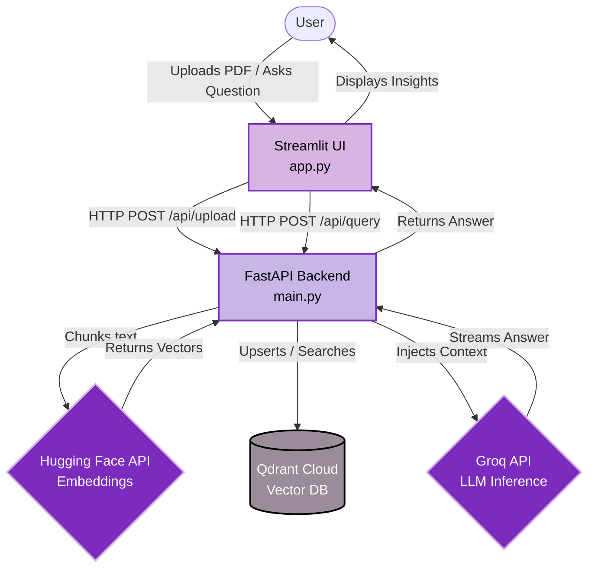

# 📄 Document AI Assistant

An enterprise-grade **Retrieval-Augmented Generation (RAG)** platform designed to extract instant, highly accurate insights from secure PDF documents. Built with a deeply optimized, highly scalable microservices architecture.

---

## 🏗️ Architecture Overview

The system is separated into a serverless frontend and a high-performance backend REST API, connected to cloud-native vector and inference engines.

- **Frontend:** Streamlit *(deployed on Streamlit Community Cloud)*
- **Backend API:** FastAPI *(deployed on Render)*
- **Vector Database:** Qdrant Cloud
- **Embedding Engine:** Hugging Face Serverless Inference API (`all-MiniLM-L6-v2`)
- **LLM Engine:** Groq API (`groq/compound`)

### 🌊 System Flow



---

## ✨ Core Features

- ⚡ **Zero-Latency Embeddings:** Completely offloads heavy PyTorch tensor operations to the Hugging Face Cloud, preventing server OOM crashes.
- 🪶 **Stateless Architecture:** The backend API remains entirely stateless, allowing instantaneous cold boots on heavily constrained server environments.
- 🎯 **Reference Tracking:** Automatically tracks and returns exact context chunks used to generate the LLM response to prevent hallucinations.
- 🎨 **B2B UI/UX:** A highly responsive, single-page application built entirely in dark mode with a professional lavender accent palette.

---

## 📁 Project Structure

```text
📦 Document-AI
├── 📜 app.py                   # Streamlit frontend UI
├── 📜 main.py                  # FastAPI backend routing and endpoints
├── 📜 data_loader.py           # PDF parsing and Hugging Face API integration
├── 📜 vector_db.py             # Qdrant Database client and schema management
├── 📜 requirements.txt         # Frontend dependencies (Streamlit)
└── 📜 backend-requirements.txt # Backend dependencies (FastAPI)
```

---

## 🔑 Environment Variables

The following secrets are required for deployment:

| Key | Description | Location |
| :--- | :--- | :--- |
| `QDRANT_URL` | The REST API URL of your Qdrant Cloud cluster | Backend (Render) |
| `QDRANT_API_KEY` | Authentication key for Qdrant | Backend (Render) |
| `GROQ_API_KEY` | API key for Groq's ultra-fast LLM routing | Backend (Render) |
| `HF_TOKEN` | Hugging Face read token for inference endpoints | Backend (Render) |
| `BACKEND_URL` | The deployed URL of the FastAPI server | Frontend (Streamlit) |

---
*Built with ❤️ using Streamlit, FastAPI, and Groq.*
